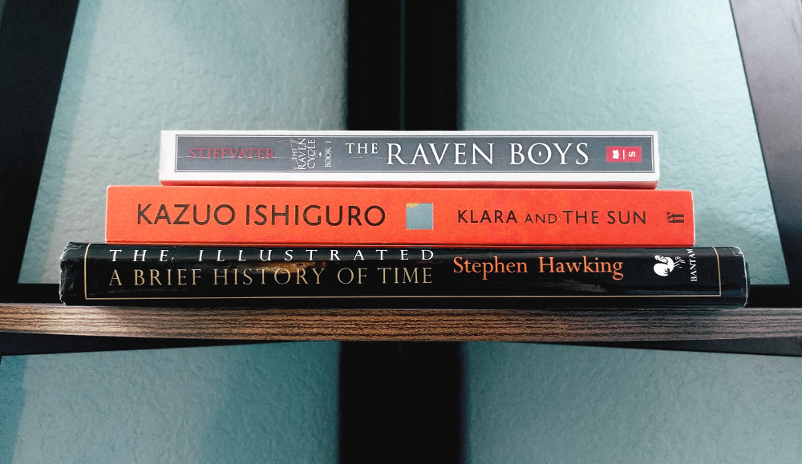

Like a lot of people, I was a really avid reader in elementary and early middle school, but my 
reading sort of just fell off a cliff in middle/high school as I became more and more 
preoccupied with much more important things, like zoning out in class and collecting half-used pens. 
However, since the  pandemic started and I began college, I've found that I really enjoy reading again and I love 
learning more about the world or immersing myself in other worlds. I especially have a soft spot for
character-driven stories because it's fun to root for someone going through tough circumstances.

I've set a goal of reading 30 books this year, which means I'm going to read at least 2.5 books
every month. 

In January I read 4 books: *Trading in Danger* and *Marque and Reprisal* by 
Elizabeth Moon (the first two in a series with interesting characters and cool space logistics), 
*Life on Mars* by Tracy K. Smith (I don't normally read poetry but this book was beautiful), and 
*Call Down the Hawk* by Maggie Stiefvater (which I unfortunately didn't really enjoy as much as 
I liked her previous series, although I did really like a couple of the characters). 

I read a whopping total of 0 books in February so I made up for it by reading 3 books in March: 
*Klara and the Sun* by Kazuo Ishiguro, *A Brief History of Time* by Stephen Hawking, and *The
Raven Boys* by Maggie Stiefvater.

## Klara and the Sun
> by Kazuo Ishiguro

A very sweet story set in the near future, told from the perspective of an AI robot. 
Klara is exceptionally observant and smart, yet she views the world around her with an almost childlike 
attitude, which is both endearing and somewhat tragic in its dramatic irony. Klara's observations 
and her musings, as well as her interactions with other people, are evocative and poignant.
I appreciated the careful details in this book which slowly revealed more and more about the world 
and its characters throughout the course of the story. Overall, I really loved this book.

## A Brief History of Time
> by Stephen Hawking

This book had me jumping rapidly back-and-forth between "Oh yeah, this makes sense!" and "What
did I just read?" As someone who's definitely no professional but who really loves learning 
about space and physics, I was pretty excited reading this and I can tell for sure that I'm going 
to have to reread it again a few times. Hawking stays away from mathematical formulas and mainly
just discusses concepts and people — how one idea lead to another and who formulated these ideas.
If there's anything in this book that actually disappointed me, it'd be the reminder that the 
study of physics has pretty obviously been dominated by a very narrow demographic... but that's
not what this book is about, so that definitely didn't detract from my opinion of it at all.

## The Raven Boys
> by Maggie Stiefvater

The first book in the *Raven Cycle* series, a young adult contemporary fantasy set in a rural 
town in Virginia, where a small group of high-schoolers embark on a search for the 
supposedly-not-so-dead Welsh king Owen Glendower. What I liked the most about this series was
the atmospheric writing and whimsical character dynamics. I never particularly cared for the
romantic aspects (they felt a bit forced), but thankfully they weren't too intrinsic to the story.
This was a re-read and I thoroughly enjoyed it as much as I did the first time I read it! 

---
### Currently Reading
- *These Violent Delights* by Chloe Gong
- *Atomic Habits* by James Clear

### On Hiatus
(a.k.a. I'll finish these when I'm in the mood!)
- *Pride and Prejudice* by Jane Austen
- *Engaging the Enemy* by Elizabeth Moon
- *Ninth House* by Leigh Bardugo

### Want to Read
(a.k.a. books I'll probably start reading once I finish with the current batch)
- *The Hobbit* by J. R. R. Tolkien
