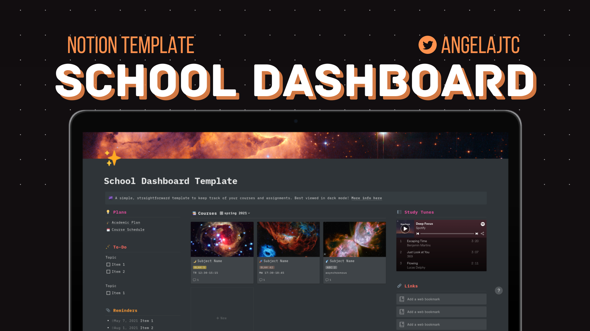

[**✨ Link to Template**](https://www.notion.so/School-Dashboard-Template-7c3703592ca54494995773e475ee2599)
*(Click "Duplicate" on the top right to get started!)*

I started using [Notion](https://www.notion.so) a little over a year ago to keep track of my academic life, and I've been in love with it ever since. I really like how versatile yet robust it is — I use it to write notes for my classes (especially for Computer Science, since it supports code blocks), plan out the courses I need for my degree, and keep track of all of my assignments. As someone who's usually terribly disorganized and forgetful, I always love finding new tools and methods to keep my life on track.

[I made a school dashboard with Notion recently](https://twitter.com/angelajtc/status/1361465004277395456), which organizes everything school-related into one holistic, easy-to-navigate view. This free-to-use template is a slight improvement of the school dashboard I personally use. Space headers can be found in [ESA/Hubble's wallpaper gallery](https://esahubble.org/images/archive/wallpapers/).

## Features

- A database to keep track of all of your past, current, and future **courses** — including prerequisites, meeting times, and more.
- A database to keep track of your **assignments** — including course, due dates, and completion status.
- An optional **academic plan** page with courses organized in a table view, best for long-term planning or brainstorming,.
- An optional **course schedule** page with courses organized in a board view, best for sorting by semester/quarter/etc.
- **Class notes** for every course.

## How To Use

To create a new course: 
1. Click the little arrow next to the blue `New` button in the **Courses** section and select the `⭐ New Subject` template. 
2. Now you can fill out the course information under the properties at the top, add a header, change the icon, etc

(The above method also works if you're in the Academic Plan or Course Schedule page.)

To start keeping track of assignments for your new course:
1. Scroll down to the **Assignments** calendar and click on the `+` button on the day the assignment is due. 
2. Under the `Course` property on the assignment's page, create a new option for your new course (you can change the color to match that of the course option you set above).
3. Now navigate back to the dashboard and click on your new course.
4. Under the **Assignments** section, click on `Filter` and select the course ("Where Course is \[course\]")

(Still trying to figure out how to link the Courses and Assignments databases so that you don't have to create what's essentially the same course option twice, but I haven't figured out a clean way to do it.)
