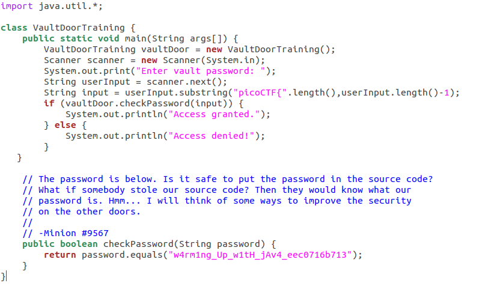
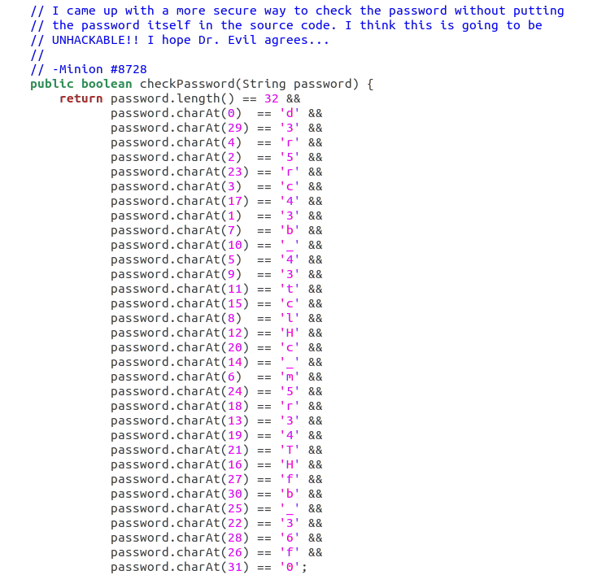
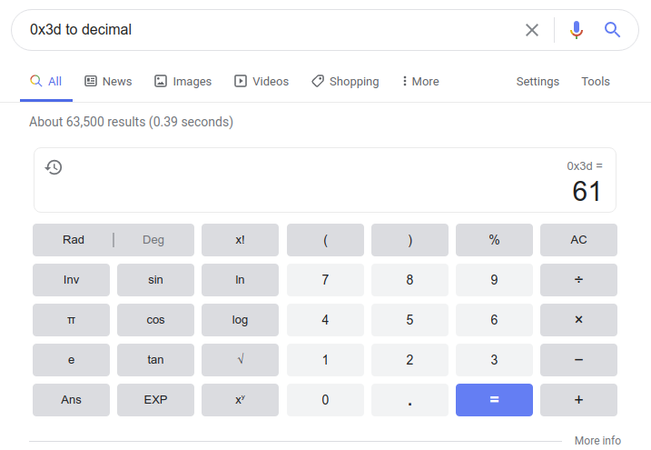
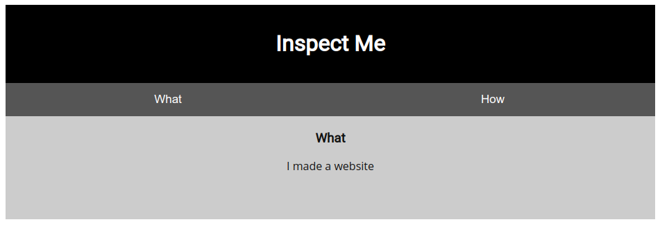
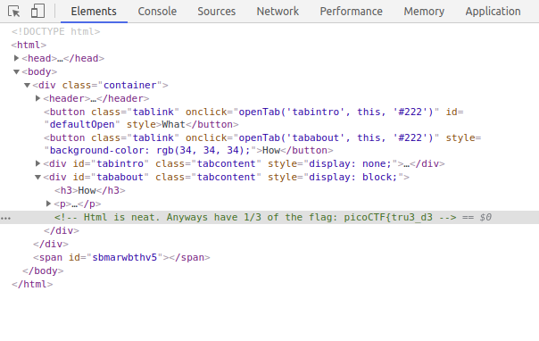
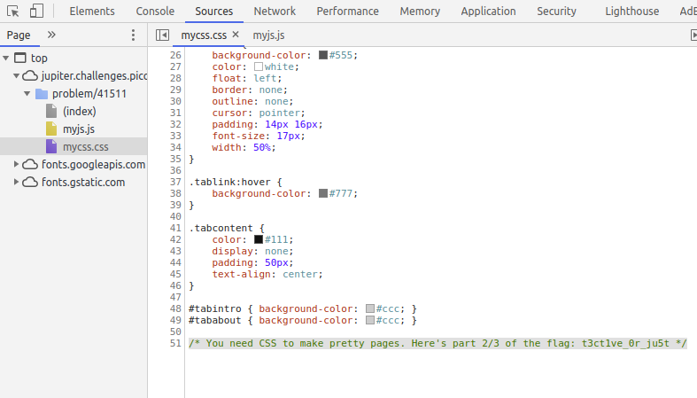
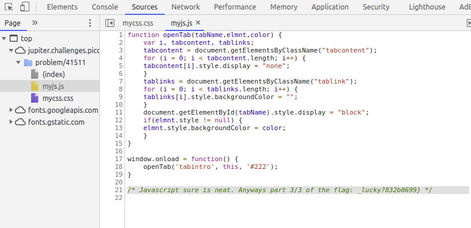

```toc
from-heading: 2
to-heading: 3
```

## General Information
[picoCTF](https://picoctf.org/) is a beginner-level competition where you can learn some basics about cybersecurity by completing small challenges about a variety of topics like cryptography, web exploitation, reverse engineering, and so on. I totally recommend this competition for anyone looking to go into cybersecurity — or, if you're like me, just up for an interesting and fun challenge.

The 2021 competition is officially starting on March 16, but there are [a number of practice challenges](https://play.picoctf.org/practice) from previous years that you can work on anytime to help sharpen your skills. The writeups here will be walk-throughs for those challenges, organized by category. I'll continue to update this page as I solve more.

Flags (the final solutions for the challenges) are submitted in the format `picoCTF{FLAG}`.


## Reverse Engineering
---
### vault-door-training

> Your mission is to enter Dr. Evil's laboratory and retrieve the blueprints for his Doomsday Project. The laboratory is protected by a series of locked vault doors. Each door is controlled by a computer and requires a password to open. Unfortunately, our undercover agents have not been able to obtain the secret passwords for the vault doors, but one of our junior agents obtained the source code for each vault's computer! You will need to read the source code for each level to figure out what the password is for that vault door. As a warmup, we have created a replica vault in our training facility. The source code for the training vault is here: `[VaultDoorTraining.java]`

#### Solution

Most challenge descriptions usually give you some subtle hints on how to solve the challenge, but in this case the solution is straightforward enough that the description is mostly just for storytelling purposes. 😛

The first thing I did for this challenge was to look at the code in the file:



There's a *lot* going on here, but the big glaring thing here is that **the entire password is stored in plaintext** at the bottom of the file. This is obviously a no-no if you're trying to hide this information from someone who might have access to your source code!

#### Flag

`picoCTF{w4rm1ng_Up_w1tH_jAv4_eec0716b713}`

---

### vault-door-1
> This vault uses some complicated arrays! I hope you can make sense of it, special agent. The source code for this vault is here: `[VaultDoor1.java]`

#### Solution



The code that checks the password in this file is a bit more complicated, but this challenge is still pretty straightforward! You don't even really need to be familiar with Java (I definitely am not) to understand what to do.

Since most programming languages tend to count the first item in a sequence as the ["zero"th item](https://en.wikipedia.org/wiki/Zero-based_numbering), `password.charAt(0)  == 'd'` probably means that the first character in the password is the letter `d`. That means the second character is the number `3`, since `password.charAt(1)  == '3'`. So the goal of this challenge is to unscramble the password by going in order from characters 0 through 31.

I was tempted to just do this unscrambling manually, but I decided not to because it sounded super boring and tedious. Instead I decided to write a Python script that would do this unscrambling for me (which turned out to take way longer than a manual unscrambling would have taken... but at least it wasn't boring!). 

First, I made a file called `vd1.txt` to store the lines that contain the characters in the password:

```
password.charAt(0)  == 'd' &&
password.charAt(29) == '3' &&
password.charAt(4)  == 'r' &&
password.charAt(2)  == '5' &&
password.charAt(23) == 'r' &&
password.charAt(3)  == 'c' &&
password.charAt(17) == '4' &&
password.charAt(1)  == '3' &&
password.charAt(7)  == 'b' &&
password.charAt(10) == '_' &&
password.charAt(5)  == '4' &&
password.charAt(9)  == '3' &&
password.charAt(11) == 't' &&
password.charAt(15) == 'c' &&
password.charAt(8)  == 'l' &&
password.charAt(12) == 'H' &&
password.charAt(20) == 'c' &&
password.charAt(14) == '_' &&
password.charAt(6)  == 'm' &&
password.charAt(24) == '5' &&
password.charAt(18) == 'r' &&
password.charAt(13) == '3' &&
password.charAt(19) == '4' &&
password.charAt(21) == 'T' &&
password.charAt(16) == 'H' &&
password.charAt(27) == 'f' &&
password.charAt(30) == 'b' &&
password.charAt(25) == '_' &&
password.charAt(22) == '3' &&
password.charAt(28) == '6' &&
password.charAt(26) == 'f' &&
password.charAt(31) == '0'
```

Then, I wrote a Python script called `vd1solution.py`, that reads the lines from `vd1.txt` and sorts them in the correct order, then uses [regular expressions](https://en.wikipedia.org/wiki/Regular_expression) (regex) to single out each character of the flag.

```python
# regex
import re
# natural sorting
from natsort import natsorted

# open the file with the lines we want to sort
file = open("vd1.txt", "r")

# store the file in a variable
lines = file.read()

# store the lines as a list of strings
linelist = lines.splitlines()

# sort the list in numerical order
sortedlines = natsorted(linelist)

# make an empty list for the characters in the flag
flag = []

# find all characters in sortedlines that are 
# inside quotes (using regex), and append them to 
# the list of characters in the flag
for l in sortedlines:
    character = re.search(r"\w(?=')", l)
    flag.append(character.group())

# print the flag as a string
print("".join(flag))
```

One obstacle I bumped into was the fact that the numbers in the parentheses aren't very easy to sort because the single-digit numbers don't start with `0`. This means the normal sorting function (`sort()`) would put numbers `10`-`19` before `2`, because the sorting function first looks at the first digit, `1`, which comes before `2`. Instead, I needed to use [natural sorting](https://en.wikipedia.org/wiki/Natural_sort_order), which treats multi-digit numbers as a single number.

```bash
$ python3 vd1solution.py
d35cr4mbl3_tH3_cH4r4cT3r5_ff63b0
```

#### Flag

`picoCTF{d35cr4mbl3_tH3_cH4r4cT3r5_ff63b0}`

## General Skills
---

### Warmed Up

> What is 0x3D (base 16) in decimal (base 10)?

#### Solution

[Hexadecimal](https://en.wikipedia.org/wiki/Hexadecimal) is a numbering system much like the one we use in our everyday lives, except instead of base 10 (where the highest single digit is 9) it's base 16 (where the highest single digit is F).

While [there is a way to manually convert](https://owlcation.com/stem/Convert-Hex-to-Decimal) from hex (base 16) to decimal (base 10), it's really a lot easier to just use a tool that can convert it for you:




#### Flag

`picoCTF{61}`

---

### 2Warm

> Can you convert the number 42 (base 10) to binary (base 2)?

#### Solution
[Binary](https://en.wikipedia.org/wiki/Binary_number) is another numbering system where there are only two possible digits: 0 and 1. Manual conversions from binary to decimal (and vice versa) are much more straightforward than conversions in hex.

I did this problem pretty quickly in my head, but [this helpful KhanAcademy video](https://www.khanacademy.org/math/algebra-home/alg-intro-to-algebra/algebra-alternate-number-bases/v/decimal-to-binary) explains the process well.


32 + 8 + 2 = 42

(**1** * 32) + (**0** * 16) + (**1** * 8) + (**0** * 4) + (**1** * 2) + (**0** * 1) = 42

**1 0 1 0 1 0** = 42

#### Flag

`picoCTF{101010}`

## Web Exploitation
---

### Insp3ct0r

> Kishor Balan tipped us off that the following code may need inspection: `https://jupiter.challenges.picoctf.org/problem/41511/` or `http://jupiter.challenges.picoctf.org:41511`

#### Solution

The description for this challenge basically tells you what you need to do right off the bat. 

I visited the URL in the description and it brought me to this rather nondescript webpage:



There was some useful information under the "How" tab about the languages this person used to make the site (HTML, CSS, and Javascript). These are the typical languages you'll find that make up most modern-day websites.

Chrome has a developer tools panel useful for debugging and editing a website's source code inside your browser. You can access this by right-clicking a webpage and selecting "**Inspect**", or just using the keyboard shortcut (`Ctrl + Shift + I` if you're using Linux).

Once I was in the developer console (under the "Elements" tab), I saw some HTML tags that I expanded to find the first part of the flag:



Then I popped on over to the "Sources" tab to find the files that contained the Javascript and CSS for the website (the HTML was here as well, under `(index)`).

`mycss.css`, written in CSS, had the second part of the flag...



And `myjs.js`, written in (you guessed it) Javascript, had the third part of the flag!



#### Flag
`picoCTF{tru3_d3t3ct1ve_0r_ju5t_lucky?832b0699}`
